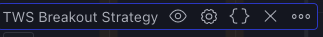
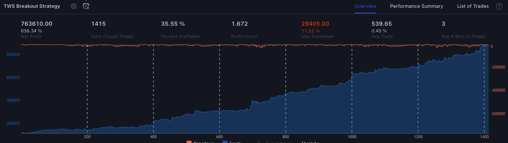
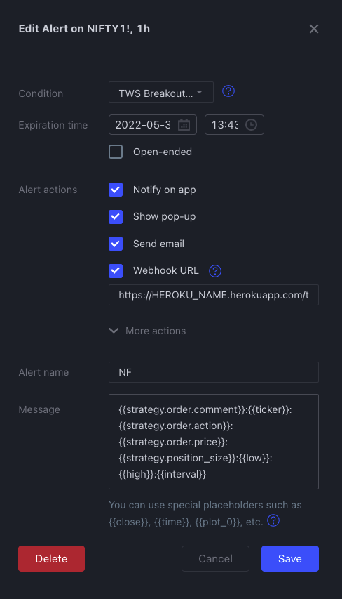

# Order Management System for TWS Algos

This is an order management system for running algo trades offered by "Trade with souvik" (https://telegram.me/tradewithsouvikbot)

## Pre-requisites

Download and install Node js application from here https://nodejs.org/en/download/

### Run

#### Heroku


[](https://heroku.com/deploy?template=https://github.com/TradeWithSouvik/order-management)


#### Tradingview Settings

- Open tradingview chart on Dsktop
- Choose any strategy from tradingview
- Click on {}    

    

- Click on the alert Icon. Next to settings Icon [Click here](https://www.tradingview.com/support/solutions/43000481368-strategy-alerts/) for official documentation

    

- Turn on webhook and add this url there https://<HEROKU_APP_NAME>.herokuapp.com/tradingview-webhook . Replace <HEROKU_APP_NAME> with your own heroku app name.

    
    
- And finally add this in the Message section

    ```[28-Apr-2022]:{{strategy.order.comment}}:{{ticker}}:{{strategy.order.action}}:{{strategy.order.price}}:{{strategy.position_size}}:{{low}}:{{high}}:{{interval}}:1:[FP|FV|ANGEL]```

